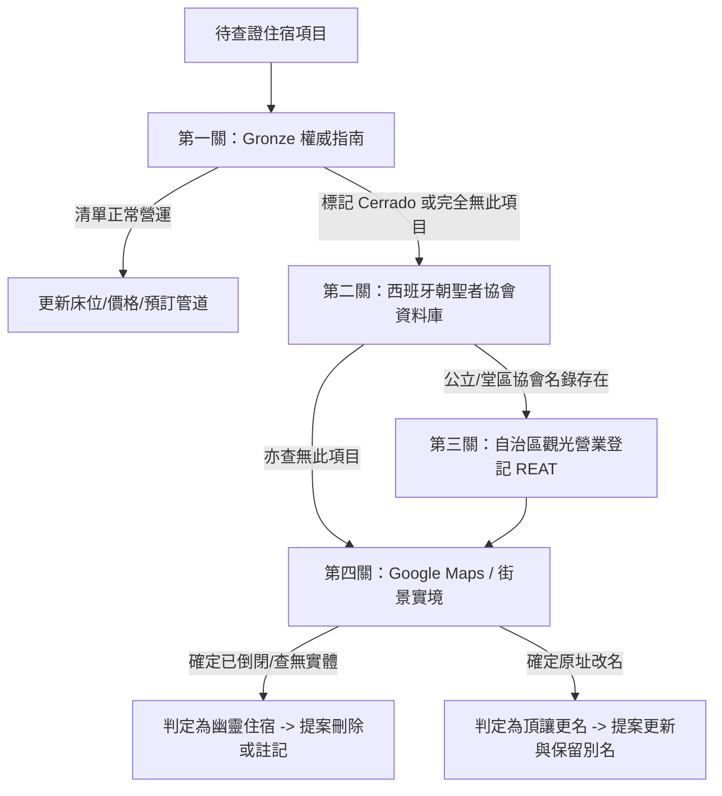

# Camino 住宿資料查證與更新技能 (Camino Accommodation Auditor)

本技能專門用於排查與維護西班牙朝聖之路規劃專案中的住宿資料庫（`src/data/accommodations.ts`）。透過多方官方與權威情報來源交互驗證，識別出不存在、已停業、重複建檔或頂讓改名的「幽靈住宿點」，並依規範進行準確更新。

---

## 核心準則與安全防線 (Core Principles)

> [!IMPORTANT]
> 1. **嚴禁直接未授權改動程式碼**：在使用者審閱並明確同意變更報告之前，絕對不可直接修改 `src/data/accommodations.ts`。
> 2. **嚴格禁止使用 Python 進行驗證**：
>    - 本專案為純 Node.js / TypeScript 生態系（本機未安裝 Python）。
>    - 嚴禁呼叫 `python`、`python3` 或相關腳本。所有資料健康度稽核、測試與驗證均須透過 Node.js 與 Vitest 執行。
> 3. **嚴格區分「季節性休業」與「永久停業」**：
>    - 西班牙朝聖之路多數庇護所僅在每年 4 月～10 月開放，冬季關閉（Cerrado en invierno / por temporada）。**此類住宿非幽靈住宿，不可剔除！**
>    - 僅有標註「永久停業（Cerrado definitivamente）」或查證實體建築已廢棄/改為民宅者，方可判定為幽靈停業點。
> 4. **更名與轉手防呆**：
>    - 若舊庇護所由新團隊接手改名，應更新原物件之 `name`、`chineseName` 與聯絡方式，並在 `notes` 保留舊有名稱（如「原 Albergue XYZ，於 2024 年更名接手」），避免使用者重複建檔或遺失歷史資料。

---

## 權威查證流程 (Verification Workflow)

查證任何住宿點時，必須依照下列四道關卡進行交叉比對：



### 第一道：Gronze.com 權威指南查驗
1. 進入 Gronze 對應航點城鎮頁面（參考 `references/sources.md`）。
2. 搜尋該住宿名稱或地址。
3. 查核狀態：
   - 正常列出：代表目前維持營運，核對最新價格（`priceEur`）、床位數（`bedCount`）、廚房設施（`hasKitchen`）。
   - 標註 `Cerrado definitivamente`：確定停業。
   - 標註 `Cerrado por reformas`：整修暫停營業，於 `notes` 補註。
   - 查無此店：進入第二道查驗。

### 第二道：西班牙全國朝聖者協會聯合會 (caminosantiago.org)
- 針對 `type: 'MUNICIPAL'` 或 `type: 'PAROCHIAL'` 之公立與教會庇護所，核對官方名錄。若官方名單無此項目且 Gronze 亦無，該公立點極可能已裁撤。

### 第三道：各大自治區觀光營業登記 (Turismo REAT)
- 核查該住宿是否具備官方營業登記號碼（Navarra, La Rioja, Castilla y León, Galicia）。

### 第四道：Google Maps 與即時街景查驗
- 檢查商家檔案是否為「Permanently Closed」。
- 檢查最近 6 個月是否有朝聖者評價。
- 檢查街景招牌是否已撤除。

---

## 幽靈住宿分類標準 (Classification)

| 分類代碼 | 判定條件 | 建議處置措施 |
| :--- | :--- | :--- |
| `GHOST_NON_EXISTENT` | 各大官方資料庫、地圖均查無任何痕跡，純屬誤植或幽靈登錄。 | 提案完全自陣列中移除。 |
| `GHOST_PERMANENTLY_CLOSED` | Gronze 明確標記 `Cerrado definitivamente`，或 Google Maps 確定永久停業。 | 提案自陣列中移除（或標記關閉）。 |
| `GHOST_RENAMED` | 同一地址/電話已轉由新庇護所經營。 | 更新名稱與資料，於 `notes` 保留「原稱：XXX」。 |
| `GHOST_DUPLICATE` | 因語系翻譯（西文、法文、巴斯克文、英文）造成重複建立兩筆。 | 整併為單一項目，中文與別名合併至備註。 |

---

## 變更報告標準流程 (Mandatory Change Report)

在進行任何程式碼更動前，**必須先向使用者輸出變更報告**，並等待使用者確認執行。

### 變更報告格式範本：

```markdown
### 📋 住宿資料變更報告 (城鎮：RONCESVALLES)

經過比對 Gronze (2026/09 官方資料) 與自治區營業登記，發現以下 2 筆需要調整：

#### 項目 1：[ACC_XXX] (幽靈住宿判定：GHOST_PERMANENTLY_CLOSED)
- **原因**：Gronze 標記 Cerrado definitivamente，街景顯示招牌已拆除。
- **查證佐證**：https://www.gronze.com/...
- **建議處置**：自 `src/data/accommodations.ts` 中移除。
- **預計變更前後對照 (Diff)**：
\`\`\`diff
-  {
-    id: 'ACC_XXX',
-    waypointId: 'RONCESVALLES',
-    name: 'Old Ghost Shelter',
-    ...
-  },
\`\`\`

#### 項目 2：[ACC_YYY] (資訊更新：價格與床位微調)
- **原因**：2026 年價格調整為 €15，床位增至 40 床。
- **查證佐證**：Gronze 官方頁面。
- **預計變更前後對照 (Diff)**：
\`\`\`diff
-    priceEur: 12,
-    bedCount: 30,
+    priceEur: 15,
+    bedCount: 40,
\`\`\`

---
請問是否批准上述變更？確認後我將為您執行最小精準替換。
```

---

## 驗證與測試流程 (Verification & Testing)

每次更新住宿資料後，**一律使用 Node.js / TypeScript 工具鏈進行驗證（嚴禁使用 Python）**：

1. **資料集健康度與幽靈點稽核（Node.js 腳本）**：
   ```bash
   node .agent/skills/camino-accommodation-auditor/scripts/audit_accommodations.mjs
   ```
   - 自動檢驗重複 ID、無效航點代碼、價格/床位異常值及網址語法。

2. **資料完整性單元測試（Vitest）**：
   ```bash
   pnpm test tests/data-integrity.spec.ts
   ```
   - 檢驗所有庇護所之航點關聯性與必要聯絡管道。

3. **TypeScript 型別與編譯檢查**：
   ```bash
   pnpm run build
   ```
