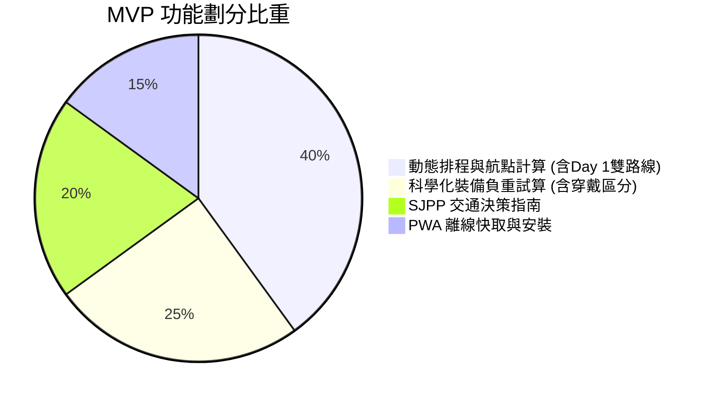

# 🇪🇸 Camino Taiwan Guide 產品需求規格書 (PRD v1.1)

---

## 1. 產品目標與願景 (Product Goals & Vision)

1. **消除行前交通焦慮**：提供專為台灣出發者設計的起點（SJPP）交通轉乘決策指引與換乘防呆提醒。
2. **實現動態自適應排程**：以城鎮航點鏈結為基礎，支援使用者依體力自訂天數、插入休息日，並在現場變更停靠點時自動動態重新平衡後續里程。
3. **第一天越嶺安全守護**：內建「拿破崙之路」與「瓦卡洛斯之路」雙路線切換機制，並具備 11/1~3/31 冬季強制封閉防護警告。
4. **科學化裝備負重與實戰避坑**：提供裝備建議清單、參考重量區間與台灣實戰備註，區分「背包負重」與「身上穿戴」，嚴格把關體重 10% 負重警戒線。
5. **離線優先與零門檻使用**：透過 Vue 3 PWA 與本機儲存機制，確保在西班牙山區斷網環境下依然能 100% 流暢查閱與操作。
6. **極低成本永續營運**：採用純前端 Jamstack 靜態託管（主機維護成本 NT$ 0），結合交通購票、網卡推薦與 Google 廣告插槽（環境變數開關控制，未啟用時完全隱形）達成收支平衡。

---

## 2. MVP 使用者故事與驗收條件 (User Stories & Acceptance Criteria)

### 【故事一：智慧排程與現場動態重新平衡】
> **作為一名** 第一次走法國之路的台灣朝聖者，  
> **我想要** 輸入出發日期與預計天數（28~36 天），並能在地圖/清單上自由插入休息日或在現場修改今日停留城鎮，  
> **以便於** 系統能自動重新平衡後續天數的每日里程，隨時掌握最新行程。

* **驗收條件 (AC)**：
  1. 系統預設提供 33 天經典分段，支援使用者增減總天數。
  2. 點擊「+ 插入休息日（Rest Day）」時，當天步行里程計為 0 km，後續所有分段日期自動順延 1 天。
  3. 當使用者變更任一天的「結束城鎮」時：
     - 自動將隔天的「起點城鎮」更新為相同地點。
     - 自動重新計算兩天的里程與爬升高度。
  4. **Day 1 雙路線切換**：
     - 提供「拿破崙之路（爬升 1250m）」與「瓦卡洛斯之路（爬升 850m）」切換選項。
     - 若出發日期落在 11 月 1 日至 3 月 31 日，系統強制鎖定瓦卡洛斯之路並跳出冬季封閉警告。
  5. 所有運算 100% 於前端本機毫秒級完成，並持久化存入 `localStorage`。

---

### 【故事二：起點 SJPP 交通轉乘決策】
> **作為一名** 剛買好歐洲機票的朝聖者，  
> **我想要** 選擇抵達城市（巴黎 CDG / 馬德里 MAD / 巴塞隆納 BCN），  
> **以便於** 獲得前往起點 SJPP 的最佳鐵公路轉乘步驟、耗時、票價與換乘防呆提醒。

* **驗收條件 (AC)**：
  1. 提供巴黎、馬德里、巴塞隆納至 SJPP 的直覺步驟卡片。
  2. 每條方案明確標註：交通工具（TGV / Renfe / ALSA 巴士）、預估耗時、預估票價區間、開行月份限制。
  3. 提供官方購票平台（SNCF / Renfe / Omio）外連連結。

---

### 【故事三：科學化裝備負重與實戰避坑】
> **作為一名** 正在打包背包的朝聖者，  
> **我想要** 輸入體重、勾選裝備並輸入自行秤重的克數，  
> **以便於** 系統能精準計算「背包淨負重」，並提醒我是否超過體重的 10%。

* **驗收條件 (AC)**：
  1. 輸入體重（kg），系統自動計算背包負重警戒線（體重 × 10%）。
  2. 裝備項目僅標註「參考重量區間（如 150g~300g）」與「台灣實戰選購建議」，使用者可自行填寫真實秤重克數。
  3. 提供「當天穿在身上（`isWornOnBody`）」切換開關；勾選者（如穿在腳上的登山鞋）**不計入背包負重**。
  4. 背包總負重超過 10% 顯示紅色警告；低於 10% 顯示綠色安全。
  5. 關鍵項目（睡袋需求、登山杖托運、床蟲防治噴霧）附帶實戰說明 Tooltip。

---

## 3. MVP 範圍定義 (MVP Scope)

